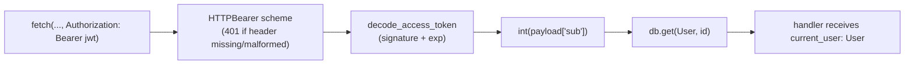

# Chapter 1 — Auth & sessions: JWT, the `CurrentUser` dependency & Google Sign-In

**Last updated:** 2026-08-12 · **Status:** ✅ current with `feat/job-runner` (Google SSO shipped in `cf36352`)

**Why we did this.** Typing a username, an email and a password into a form is
the single biggest thing standing between someone opening Thyme and using it —
and it's the *first* thing a demo viewer sees. Google Sign-In turns that into one
tap. The interesting part isn't the button; it's that adding a second front door
must not create a second session system. Both doors had to end in exactly the
same place: a JWT that we issued, and a `CurrentUser` dependency that neither
door has to know about.

**What this chapter covers.** How a session begins (three ways: register, login,
Google), how it's carried (a bearer token in `localStorage`), how it's resolved
on every request (one dependency), and what verifying a Google ID token
*actually* involves.

---

## 1.1 Mental model — two front doors, one session

> **Google authenticates; we authorize.** Google's only job is to prove, once,
> that the person at the keyboard controls a particular verified email address.
> The moment that's proven, Google is out of the loop entirely — we mint *our*
> JWT and every subsequent request is authenticated by us. There is no Google
> session, no Google refresh token, no "log in to Google again" path.

> **A session is a signed claim about `user.id`, and nothing more.** Our access
> token carries three claims — `sub` (the user id, as a string), `iat`, `exp` —
> signed HS256 with `SECRET_KEY`. There is no server-side session store to look
> up, and no revocation list; a token is valid until it expires. See
> [security.py](../../backend/app/core/security.py).

The shape that falls out of those two ideas:

```
register ─┐
login   ──┼──► create_access_token(user.id) ──► "Bearer <jwt>" ──► get_current_user ──► User
google  ─┘        (the ONLY place a session is born)                (the ONLY place it's read)
```

Everything after the funnel is shared. That's why the Google feature added a
route and a verifier and touched **nothing** about how the other ~60 endpoints
authenticate.

### Why the ID token, not the OAuth code flow

Google offers two ways to do this. We use **Google Identity Services (GIS)** in
the browser, which hands us a `credential` — an *ID token*, itself a JWT signed
by Google — and we verify it on the server.

The alternative (the "authorization code" flow) means a redirect to Google, a
callback URL, a client **secret**, and a server-to-server code→token exchange.
It exists so that your backend can obtain *access* tokens to call Google APIs
on the user's behalf (Calendar, Drive, Gmail).

We don't want any Google API. We only want an identity. So:

| | ID-token flow (what we do) | Authorization-code flow |
|---|---|---|
| Client secret | none needed | required, must be kept server-side |
| Redirects / callback URLs | none | required, per environment |
| What the server receives | a signed JWT of claims | a code to exchange |
| Can call Google APIs later | no | yes (that's the point) |
| Moving parts | one endpoint | redirect + callback + exchange |

Picking the smaller flow is the whole reason this feature is ~80 lines of
backend code.

---

## 1.2 The pieces

| Concern | File |
|---|---|
| Password hashing, JWT mint/decode, **Google verify** | [security.py](../../backend/app/core/security.py) |
| `/auth/register`, `/auth/login`, `/auth/google`, `/auth/me` | [routes/auth.py](../../backend/app/api/routes/auth.py) |
| `DbSession`, `CurrentUser`, the shared 401 | [deps.py](../../backend/app/api/deps.py) |
| `users` table (nullable password, role, AI usage) | [models/user.py](../../backend/app/models/user.py) |
| Request/response schemas (`GoogleAuthRequest`, `Token`, `UserRead`) | [schemas/user.py](../../backend/app/schemas/user.py) |
| `GOOGLE_CLIENT_ID` setting | [config.py](../../backend/app/core/config.py) |
| Nullable-password migration | [a1f7c3e29b04](../../backend/alembic/versions/a1f7c3e29b04_make_hashed_password_nullable.py) |
| The button (GIS script + render + callback) | [google-button.tsx](../../frontend/src/components/auth/google-button.tsx) |
| Session state, token restore | [auth-context.tsx](../../frontend/src/lib/auth-context.tsx) |
| `tokenStore`, `authApi.google` | [api.ts](../../frontend/src/lib/api.ts) |

---

## 1.3 Data model — a user with no password

One column changed for SSO, and it changed in the most boring possible way:

```python
# app/models/user.py
# Nullable: users who sign in with Google (SSO) have no password.
hashed_password: Mapped[str | None] = mapped_column(String(255), nullable=True)
```

Note what is *not* in the table: no `google_sub`, no `provider`, no
`oauth_accounts` join table. **Identity is keyed on the verified email address.**

That's a real decision with a real trade-off:

- ✅ Trivially simple, and it gives you account *linking* for free — a user who
  registered with `alice@gmail.com` + password and later taps "Continue with
  Google" lands in the *same row*, not a duplicate.
- ⚠️ It's only safe because we refuse to proceed unless Google says
  `email_verified: true`. Without that check, any identity provider that let
  someone claim an unverified email could take over an existing account.
- ⚠️ If a user ever changes their Google email, they look like a new person to
  us. Storing Google's `sub` (a stable, provider-scoped user id) alongside the
  email is the fix — see [§1.8](#18-future-enhancements).

The migration is a widening (`NOT NULL` → `NULL`), so it's safe to run against
live data; the `downgrade()` deliberately documents that it can't be reversed
while SSO-only rows exist.

---

## 1.4 The flow — browser to database and back

```mermaid
sequenceDiagram
  participant U as User
  participant B as Browser (GoogleButton)
  participant G as Google Identity Services
  participant API as FastAPI /auth/google
  participant GC as Google certs (public)
  participant DB as Postgres

  U->>B: click "Continue with Google"
  B->>G: GIS popup, user picks account
  G-->>B: callback({ credential: "<ID token JWT>" })
  B->>API: POST /api/v1/auth/google { credential }
  API->>API: google_client_id set? else 503
  API->>GC: fetch/cache signing certs
  API->>API: verify signature, aud == client_id, exp, iss
  API->>API: email_verified? else 401
  API->>DB: SELECT user WHERE email = :email
  alt no such user
    API->>DB: derive unique username, INSERT (hashed_password = NULL)
  end
  API-->>B: 200 { access_token, user }
  B->>B: tokenStore.set(token); setUser(user)
  B->>U: router.replace(next ?? "/dashboard")
```

**Backwards** (every request after that) is the shorter, more important half:



That whole chain is nine lines of `get_current_user`, exposed as a type alias:

```python
CurrentUser: TypeAlias = Annotated[User, Depends(get_current_user)]
```

…which is why every protected handler reads as ordinary Python:

```python
async def read_me(current_user: CurrentUser) -> User:
    return current_user
```

On a full page reload the frontend has a token but no user object, so
[auth-context.tsx](../../frontend/src/lib/auth-context.tsx) calls `GET /auth/me`
once to rehydrate — that endpoint exists purely as "who is this token?".

---

## 1.5 The tricky part — what "verify the token" really means

The entire security boundary of this feature is four lines:

```python
def verify_google_id_token(credential: str) -> dict:
    return id_token.verify_oauth2_token(
        credential, google_requests.Request(), settings.google_client_id
    )
```

It's worth knowing exactly what that call does, because "it's a JWT, just decode
it" is how people ship auth bypasses.

**What Google's library checks for you:**

1. **Signature** — fetches Google's public signing certs (over HTTPS, cached)
   and verifies the token was signed by Google. This is what makes a forged
   token useless: an attacker can craft any claims but cannot sign them.
2. **`aud` (audience) == our client ID** — passed in as the third argument. This
   is the check people forget. Without it, an ID token minted for *any other
   Google app* would be accepted here; the user is real, but they never intended
   to sign in to *us*.
3. **`iss`** — must be `accounts.google.com` / `https://accounts.google.com`.
4. **`exp`** — Google ID tokens live ~1 hour; expired ones are rejected.

Any failure raises `ValueError`, which the route turns into a single, deliberately
vague 401 (`GOOGLE_INVALID`) — the client never learns *which* check failed.

**What it does not check, and we do:**

```python
email = (claims.get("email") or "").lower()
if not email or not claims.get("email_verified", False):
    raise HTTPException(401, GOOGLE_UNVERIFIED)
```

A validly-signed token can still carry an *unverified* email. Since our entire
identity model is "the email is the user" (§1.3), skipping this check would be
the account-takeover hole. Lower-casing matters too: Google may return
`New.Person@example.com`, and we must not create a second row for
`new.person@example.com`.

**Offline verification is the point.** Notice there's no call to a Google
*userinfo* endpoint. Verification is cryptographic — signature plus claims —
against cached public certs. That's what keeps a sign-in fast and keeps Google's
availability off our critical path (mostly; the certs do need fetching once).

### Deriving a username nobody has

Our `users` table wants a unique username 3–30 chars of `[a-z0-9_]`, and Google
gives us an email and a display name. `_unique_username()` bridges the gap:

```python
base = re.sub(r"[^a-z0-9_]", "", email.split("@", 1)[0].lower()) or "user"
if len(base) < 3:
    base = f"{base}user"
base = base[:30]
# then: base, base1, base2, … until unused
```

Two details that look like fussiness but aren't: `or "user"` covers an email
whose local part is entirely punctuation (yes, that's legal), and the suffix loop
truncates the *base* — `base[: 30 - len(suffix)]` — so appending `12` to a
30-char name can't overflow the column.

### Degrading when Google isn't configured

`GOOGLE_CLIENT_ID` is empty by default, and both sides handle that explicitly
rather than exploding:

- **Backend:** `/auth/google` returns **503** with a clear message — the endpoint
  exists but is honestly unavailable.
- **Frontend:** with `NEXT_PUBLIC_GOOGLE_CLIENT_ID` unset, `GoogleButton`
  renders a disabled button plus "Sign-in isn't configured yet" and never loads
  the GIS script.

This is what lets a fresh clone build, boot and run the whole app before anyone
has visited Google Cloud Console.

### One React detail worth stealing

GIS calls our callback from *outside* React, holding whatever closure it was
initialised with. Re-initialising on every render is wasteful; capturing a stale
closure is a bug. The fix is the ref-latch pattern:

```tsx
const handlerRef = useRef(handleCredential);
useEffect(() => { handlerRef.current = handleCredential; }, [handleCredential]);
// GIS gets a stable arrow that always reads the latest handler:
gis.initialize({ client_id: CLIENT_ID, callback: (res) => handlerRef.current(res.credential) });
```

---

## 1.6 How to run & test

### Creating the OAuth client (once)

1. Google Cloud Console → **APIs & Services → Credentials → Create credentials →
   OAuth client ID → Web application**.
2. **Authorized JavaScript origins** — every origin that will render the button:
   `http://localhost:3000` for dev, plus the deployed frontend URL.
   (No redirect URIs needed — that's the code flow, not this one.)
3. Copy the client ID. It is **public**; it is not a secret.

### Wiring it up

```bash
# backend/.env
GOOGLE_CLIENT_ID=1234-abc.apps.googleusercontent.com

# frontend/.env.local
NEXT_PUBLIC_GOOGLE_CLIENT_ID=1234-abc.apps.googleusercontent.com   # same value!
```

Then apply the migration and start both apps:

```bash
cd backend && uv run alembic upgrade head && uv run fastapi dev app/main.py
cd frontend && npm run dev
```

### Testing it

[tests/test_auth_google.py](../../backend/tests/test_auth_google.py) covers the
route without ever touching Google: the verifier is monkeypatched **in the route
module** (`app.api.routes.auth.verify_google_id_token`, i.e. the name the handler
actually looks up), while the database is the real Postgres test session — so
username generation, uniqueness and persistence are genuinely exercised.

```bash
cd backend && uv run pytest tests/test_auth_google.py -v
```

Six cases, one per branch: first sign-in creates, second sign-in reuses,
username collision gets suffixed, unverified email → 401, bad token → 401,
unconfigured server → 503.

Manual smoke, no browser needed for the second half:

```bash
# password login → grab a token
curl -s localhost:8000/api/v1/auth/login \
  -H 'content-type: application/json' \
  -d '{"email":"you@example.com","password":"..."}' | jq -r .access_token

# then prove the funnel: the same dependency accepts it
curl -s localhost:8000/api/v1/auth/me -H "Authorization: Bearer $TOKEN" | jq
```

---

## 1.7 Gotchas

- **🐛 `POST /auth/login` with an SSO-only email 500s.** `verify_password()` does
  `hashed_password.encode()`, and an SSO row has `hashed_password = None`, so the
  handler raises `AttributeError` → 500 instead of a clean 401/409. It's only
  reachable if someone Google-signs-up and then tries the password form with
  that email. The fix is a guard in
  [routes/auth.py](../../backend/app/api/routes/auth.py) (`if user.hashed_password is None:`
  → 401 with "This account uses Google Sign-In"), which is also a much better
  message. **Not yet fixed — open item.**
- **The client ID must match on both sides.** A frontend/backend mismatch fails
  the `aud` check, so *every* sign-in 401s while the button itself works
  perfectly. Check that first when Google sign-in "just stopped working".
- **Origins are exact.** `http://localhost:3000` ≠ `http://127.0.0.1:3000` to
  GIS. Loading the app on the IP address makes the button refuse to render.
- **The token lives in `localStorage`**, so it's readable by any script on the
  origin (XSS-exposed) and it does not travel to the backend automatically. That
  was a deliberate MVP trade (no CSRF concerns, dead-simple mobile/API testing);
  an httpOnly cookie is the upgrade path.
- **No revocation, no refresh.** `ACCESS_TOKEN_EXPIRE_MINUTES` is 1 day; logging
  out just drops the local copy. A leaked token is valid until it expires, and
  changing `SECRET_KEY` invalidates *everyone's* sessions at once (which is the
  only "log everybody out" lever we have).
- **Google's popup needs a real origin.** Opening the frontend from a `file://`
  URL or an unlisted preview domain silently renders nothing — check the browser
  console for GIS origin errors rather than looking at our logs.
- **`expire_on_commit=False`** on the session factory is why `_token_for(user)`
  can read `user.id` after `await db.commit()` without another query. See
  [Ch 14](11-fastapi-request-journey.md) for why that setting matters generally.

---

## 1.8 Future enhancements

- **Store Google's `sub`** on first sign-in (nullable `google_sub` column) and
  prefer it over email when matching. Survives email changes and makes the
  linking rule explicit instead of implicit.
- **Fix and formalise account linking** — the login guard above, plus a "set a
  password" flow so an SSO user can add password access, and an explicit
  "connect Google" action on the profile page.
- **httpOnly refresh cookie + short-lived access token**, so a stolen access
  token is worth minutes rather than a day, and sessions can be revoked.
- **One Tap / auto-select** — GIS can show the account chooser on page load,
  which is a meaningfully shorter path than click-then-choose.
- **Sign in with Apple / GitHub** would now be a second ~40-line route: verify
  provider token → find-or-create by verified email → `_token_for(user)`. The
  funnel in §1.1 is what makes that true.
